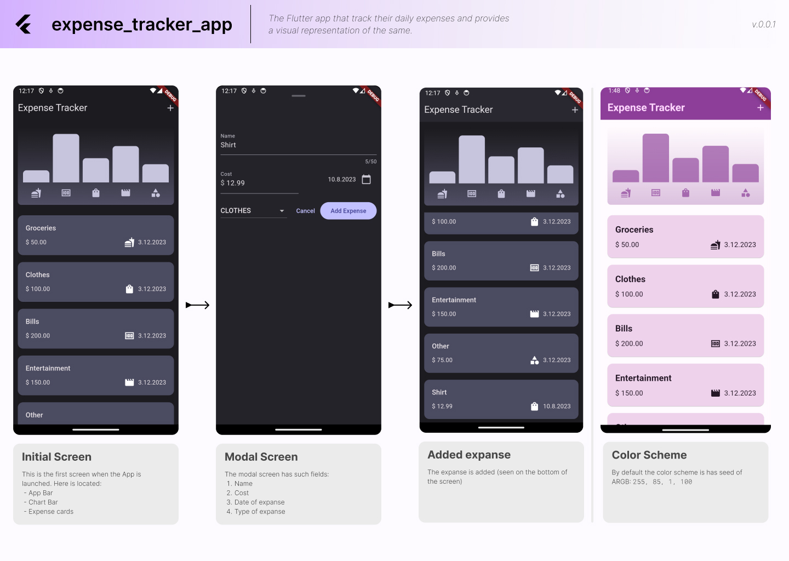

# Expense Tracker App

## Project Description

The Flutter app that track their daily expenses and provides a visual representation of the same.

## Business logic


## Features

- Add new transactions
- Delete transactions
- Visual representation of transactions

## Installation

To get started with this project, follow these steps:

1. Clone the repository:
    ```
    git clone https://github.com/yourusername/expense_tracker_app.git
    ```

2. Navigate into the project directory:
    ```
    cd expense_tracker_app
    ```

3. Install the dependencies:
    ```
    flutter pub get
    ```

4. Run the app:
    ```
    flutter run
    ```

## License

[MIT](https://choosealicense.com/licenses/mit/)

## Acknowledgements

- Flutter
- Dart
